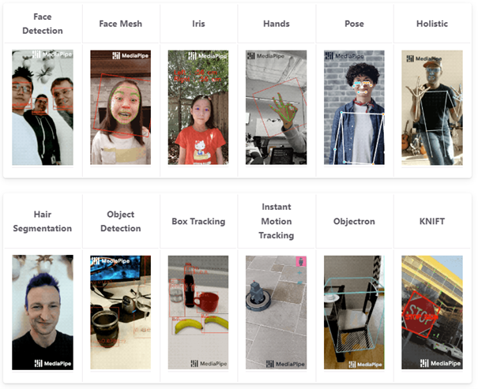

Bu repoda Google'ın açık kaynaklı bir ML kütüphanesi olan MediaPipe'ın Pose(BlazePose) ve Holistic sınıfları için Türkçe dökümantasyon yer almaktadır.   
Aşağıdaki linklerde bu çözümlere ait birer örnek bulabilirsiniz.

- BlazePose örnek video: [Solo Zeybek](https://www.youtube.com/watch?v=TkPyRMrYUN8&t=2s)
- Holistic örnek video: [Bel Ağrısı Egzersizleri](https://www.youtube.com/watch?v=olS2u2oDGnA)

Mediapipe, Google tarafından geliştirilmiş ücretsiz ve açık kaynaklı bir makine öğrenmesi kütüphanesidir. Python, JavaScript, IOS ve Android desteği bulunmaktadır. Modüler yapısı sayesinde bize kullanımı kolay ve hızlı uygulanabilir bir yapı sunuyor. Bu kütüphane ile aşağıda görülen çeşitli konularda projeler üretebiliriz. 

  

  

### BlazePose

- Mediapipe’ın pose tespiti çözümü BlazePose olarak isimlendirilmiştir. Tek bir frame’den 33 adet noktayı tespit edebiliyor. Normalde pose modelleri için kullanılan bir standart olan COCO topolojisinde ise bu sayı 17’dir. BlazePose, mobil cihazlarda bile gerçek zamanlı çalışabilmektedir. GPU kullanırsak çok da hızlı olacaktır, bu sayede diğer Mediapipe çözümlerini de aynı anda çalıştırabiliriz. COCO topolojisinde sadece ayakların tam olarak nerede olduğu belirtilir fakat ayağın hangi hareketleri yaptığı saptanamaz. Bu da dans, fitness gibi hareketlerin tespitinin eksik olmasına neden olur. BlazePose’un 33 noktası ile bu sorun çözülmüştür. BlazePose’un tespit ettiği noktalar aşağıdaki şekilden görülebilir: 

  

  
BlazePose, iki adımlı bir sistem kullanır. Bunlardan ilki dedektördür. Bu adımda pose’u saptanacak kişinin yeri frame’de saptanmaya çalışılır(ROI-Region of Interest). İkinci adım ise izleyicidir(tracker). Bu adımda dedektör adımında tespit edilen noktaların takibi sağlanır. Eğer noktalar kaybedilirse, ilk adıma dönüp tekrardan dedektörün çalışması sağlanır.   
Yapılan araştırmalar sonucunda, vücudun gövdesinin tespiti için en hızlı yöntemin ilk olarak yüzün tespit edilmesi, ondan sonra da vücudun kalan kısımlarının tespit edilmesi olduğu tespit edilmiştir. BlazePose da bu yöntemi kullanır. O yüzden kullanacağımız videolarda insanların yüzünün gözükmesi son derece önemlidir, aksi halde poz tespit edilmesinde gecikmeler yaşanacak ve gerçek zamanlı bir iletim söz konusu olmayacaktır. Yüzün konumunun ve tespit edilmesinin ardından kalçaların orta noktası, insanı çevreleyen dairenin yarıçapı ve kalça orta noktası hizası ile omuzların arasındaki açı tespit edilir. Bu noktaların tespiti ile en kompleks hareketlerin bile pose takibi yapılabilmektedir. Bu yöntem için Leonardo Da Vinci’nin meşhur Vitrivius Adamı çiziminden esinlenilmiştir. Bu çizimde insanın simetrisi ve altın orana vurgu yapılmıştır.  

  

  

  

  

İzleyici(tracker) tarafı ise diğer yaklaşımlarda kullanılan sadece ısı haritası(heatmap) yöntemini değil, onunla birleştirilmiş bir gözetimli regresyon yoluyla çözüme ulaşır. Farklı donanımlara uyum sağlamak için üç farklı izleyici modeli sağlanmıştır. Bunlar Lite, Full ve Heavy olarak adlandırılır. En yüksek doğruluğu Heavy modeli verirken, en hızlı Lite modeli çalışır.  

### MediaPipe Holistic 

- Mediapipe’ın Holistic yöntemi, aynı anda yüz, el ve poz takibi yapılabilmesini sağlar. Çeşitli fizyoterapik egzersizlerde el parmaklarının hareketlerinin de önemli olmasından dolayı Holistic yöntemi projemiz için daha uygun olabilir. Bu yöntem ile 33 poz, 21 el ve 468 yüz işaret noktası ile 543 işaret noktasını görüntü üzerinde saptayabiliriz. Mobil cihazlarda bile gerçek zamanlı çalışabilme özelliğine sahiptir. İşaret dilinin anlamlandırılmasında kullanılabilir. Holistic yöntemi çalışırken ilk olarak poz tespiti yapılır, ardından tespit edilen poz işaret noktalarından yola çıkılarak da eller ve yüz bölgesi saptanıp o bölümler ayrıca işaretlenir. En son olarak bulunan tüm noktalar birleştirilir. Poz tespitinde el bölgelerinin tespitinin doğruluk seviyesinin düşük olması durumunda, ek bir modelle el bölgesine ayrıca kırpma işlemi uygulanır. Bu sayede el takibi sisteminin çalışmasının aksamaması, doğruluğun artırılması sağlanır. 

  

  

##### Kaynakça  
- https://www.mekinfo.net/google-mediapipe-nedir/  
- https://burakbagatarhan.medium.com/mediapipe-kullanarak-i%CC%87leri-seviye-computer-vision-e36dbb4c60f2  
- https://ai.googleblog.com/2020/08/on-device-real-time-body-pose-tracking.html 
- https://ai.googleblog.com/2020/12/mediapipe-holistic-simultaneous-face.html
- https://google.github.io/mediapipe/solutions/pose.html
- https://google.github.io/mediapipe/solutions/holistic.html
- https://colab.research.google.com/drive/1uCuA6We9T5r0WljspEHWPHXCT_2bMKUy
- https://colab.research.google.com/drive/16UOYQ9hPM6L5tkq7oQBl1ULJ8xuK5Lae?usp=sharing
- https://drive.google.com/file/d/10WlcTvrQnR_R2TdTmKw0nkyRLqrwNkWU/preview
- https://arxiv.org/pdf/2006.10204.pdf

